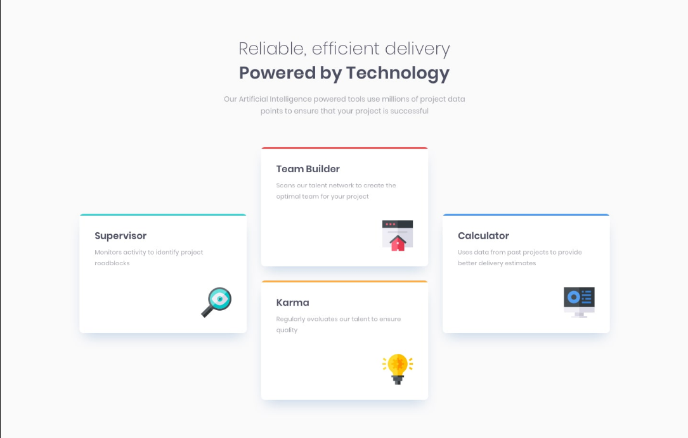

# Frontend Mentor - Four card feature section solution

This is a solution to the [Four card feature section challenge on Frontend Mentor](https://www.frontendmentor.io/challenges/four-card-feature-section-weK1eFYK). Frontend Mentor challenges help you improve your coding skills by building realistic projects. 

## Table of contents

- [Overview](#overview)
  - [The challenge](#the-challenge)
  - [Screenshot](#screenshot)
  - [Links](#links)
- [My process](#my-process)
  - [Built with](#built-with)
  - [What I learned](#what-i-learned)
  - [Continued development](#continued-development)
  - [Useful resources](#useful-resources)
- [Author](#author)
- [Acknowledgments](#acknowledgments)

## Overview

### The challenge

Users should be able to:

- View the optimal layout for the site depending on their device's screen size

### Screenshot

### Links

- Solution URL: [https://www.frontendmentor.io/solutions/four-card-feature-section-completed-using-only-css-LT2Tmf9L2](https://www.frontendmentor.io/solutions/four-card-feature-section-completed-using-only-css-LT2Tmf9L2)
- Live Site URL: [https://ameyadeokule.github.io/four-feature-card/](https://ameyadeokule.github.io/four-feature-card/)

## My process

### Built with

- Semantic HTML5 markup
- CSS custom properties
- CSS Grid

### What I learned

Working with CSS Grid and converting the layout for mobile devices and also using a SUDO class to get some details correctly 

### Continued development

I want to integrate SASS into this webpage and in future convert it to React SPA

### Useful resources

- [CSS Tricks for Grid](https://css-tricks.com/snippets/css/complete-guide-grid/) - Helped to understand CSS grid fragments

- [CSS Tricks Pseudo classes selector](https://css-tricks.com/pseudo-class-selectors/) - Helped me to understand ::before and ::after sudo classes and how to style them.

## Author

- Name - [Ameya Deokule]
- Frontend Mentor - [@ameyadeokule](https://www.frontendmentor.io/profile/ameyadeokule)

## Acknowledgments

I would like thank Kethmar Salumets [@developerhabits](https://twitter.com/developerHabits) for encouraging me to start completing challenges on Frontend Mentor.

